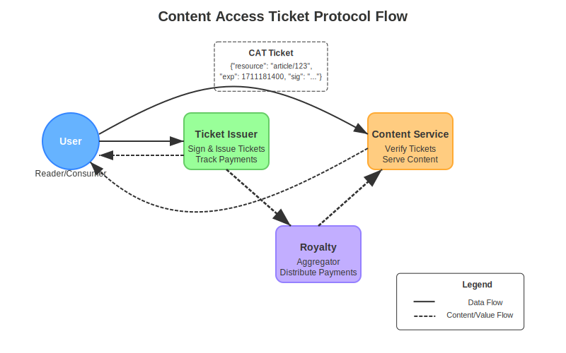

# Content Access Ticket Protocol (CAT Protocol)

[](https://opensource.org/licenses/MIT)

### Overview

This repository provides a basic implementation of the Content Access Ticket (CAT) Protocol, focusing on demonstrating a content service and a ticket issuer. The CAT Protocol enables decentralized, signed, time-limited access to paywalled or premium content by issuing verifiable tickets.

For a detailed specification of the protocol, including sequence diagrams and technical details, please refer to [CAT.md](CAT.md).

### Protocol Flow Diagram

The following diagram illustrates the key stakeholders and workflow of the CAT Protocol:



1. User requests and pays for access to content
2. Ticket Issuer signs and returns a CAT ticket
3. User presents the ticket to the Content Service
4. Content Service returns the requested content
5. Content Service logs the access for royalty tracking
6. Royalties are distributed to content creators and publishers


### Implementation

This repository includes a basic implementation of a CAT content service using FastAPI and a ticket issuer using the `cryptography` library.

#### Content Service

The `content_service.py` file provides an example of how to verify CAT tickets and serve content. It uses a mock database for trusted issuers and content.

##### Usage

1.  Install dependencies: `pip install -r requirements.txt`
2.  Run the service: `uvicorn content_service:app --reload`

    This will start the FastAPI server, typically on `http://localhost:8000`.
3.  Access content: `GET http://localhost:8000/content?ticket=<base64_encoded_ticket>&lang=en`

    *   Replace `<base64_encoded_ticket>` with a valid ticket generated by the ticket issuer.
    *   The `lang` parameter is optional and defaults to `en` (English).  It specifies the language of the content to be returned.

#### Ticket Issuer

The `ticket_issuer.py` file provides an example of how to generate Ed25519 key pairs and create signed CAT tickets.

##### Usage

1.  Run the script: `python ticket_issuer.py`

    This will generate a new Ed25519 key pair and a sample ticket.  The output will include:
    *   The public key (in hex format), which needs to be added to the `TRUSTED_ISSUERS` dictionary in `content_service.py`.
    *   A base64 encoded ticket.
2.  Update `content_service.py`: Copy the generated public key and add it to the `TRUSTED_ISSUERS` dictionary in `content_service.py`.  For example:

    ```python
    TRUSTED_ISSUERS = {
        "npub1test": "<your_generated_public_key_hex>",
        # ... other issuers
    }
    ```
3.  Access content: Use the generated base64 encoded ticket to access content via the content service, as described above.

### Example

Here's a complete example, assuming you've run both `ticket_issuer.py` and `content_service.py`:

1.  **Run `ticket_issuer.py`**:

    ```bash
    python ticket_issuer.py
    ```

    This will output something like:

    ```
    Public Key (Hex): 710e354519c02461ceaf78e4febe6a0f01c422ca07d42a1be063ce13abdf9739
    Base64 Encoded Ticket: eyJyZXNvdXJjZSI6ICJodHRwczovL2V4YW1wbGUuY29tL2FydGljbGUvYWJjMTIzIiwgInRzIjogMTcwNzM3NzU0MCwgImV4cCI6IDE3MDczNzc4NDAsICJjaHVuayI6ICIxIiwgInB1YmtleSI6ICJucHViMXRlc3QiLCAic2lnIjogIm1vY2tz aWduYXR1cmUifQ==
    ```

2.  **Update `content_service.py`**:

    ```python
    TRUSTED_ISSUERS = {
        "npub1test": "710e354519c02461ceaf78e4febe6a0f01c422ca07d42a1be063ce13abdf9739",
        # ... other issuers
    }
    ```

3.  **Access Content**:

    ```bash
    curl "http://localhost:8000/content?ticket=eyJyZXNvdXJjZSI6ICJodHRwczovL2V4YW1wbGUuY29tL2FydGljbGUvYWJjMTIzIiwgInRzIjogMTcwNzM3NzU0MCwgImV4cCI6IDE3MDczNzc4NDAsICJjaHVuayI6ICIxIiwgInB1YmtleSI6ICJucHViMXRlc3QiLCAic2lnIjogIm1vY2tz aWduYXR1cmUifQ==&lang=fr"
    ```

    This should return the French version of the content chunk "1" from the resource "https://example.com/article/abc123".

### License

This project is licensed under the MIT License - see the [LICENSE](LICENSE) file for details.

