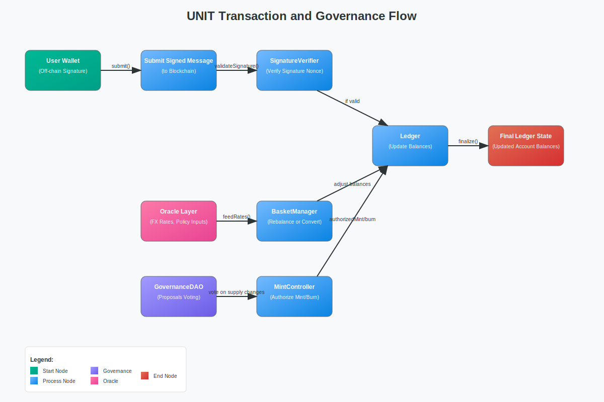

# Architecture Design for Unified Central Bank Token (UNIT)

## Overview

This document outlines the technical architecture for a decentralized, Proof-of-Work blockchain supporting the UNIT token — a programmable, sovereign-backed digital currency co-issued by multiple central banks. The design supports secure issuance, neutral validation, off-chain message settlement, and composable governance.

---

## 1. High-Level Layers

### 1.1 Consensus Layer

* **Mechanism**: Proof-of-Work (PoW)
* **Purpose**: Neutral, decentralized security and immutability
* **Block Time**: Configurable (e.g., 10 seconds)
* **Incentives**: Miners receive UNIT via controlled issuance

### 1.2 Ledger Layer

* **Model**: Account-based
* **State**: Address → Balance mapping
* **Signature support**: ECDSA / EdDSA
* **Nonce management**: To prevent replay attacks

### 1.3 Token Layer

* **Native token**: `UNIT`
* **Issuers**: Authorized central bank addresses
* **Minting/Burning**: Restricted to oracle-authenticated identities
* **Multi-token support**: `FedUSD`, `ECB_EUR`, `BOJ_JPY`, etc.
* **Basket definition**: Smart contract for weighted value aggregation

### 1.4 Oracle Layer

* **Purpose**: Provide FX rates, inflation targets, governance signals
* **Model**: Multi-signature validators (minimum 2/3 quorum)
* **Feeds**: Chainlink-style, updated at regular intervals

### 1.5 Governance Layer

* **Voting**: On-chain weighted voting by issuer addresses
* **Proposal types**: Token composition, inflation policy, circuit breakers
* **Thresholds**: Configurable consensus thresholds (e.g., 2/3 or 3/4)

### 1.6 Compliance Layer

* **Wallet registration**: Optional licensing layer for custodial wallets
* **Transaction visibility**: Public with optional ZK circuits
* **AML logic**: Implementable via hooks in transfer functions

---

## Architecture UML Diagram



*Figure: UML diagram illustrating the transaction, validation, and governance flow in the UNIT architecture.*

---

## 2. Data Structures

### 2.1 Account

```json
{
  "address": "0x123...",
  "balance": 1000,
  "nonce": 42,
  "metadata": {
    "issuer_tag": "FedUSD",
    "KYC_level": "basic"
  }
}
```

### 2.2 Signed Message

```json
{
  "from": "0xAlice",
  "to": "0xBob",
  "amount": 500,
  "nonce": 21,
  "signature": "0xabc..."
}
```

### 2.3 FX Rate Feed

```json
{
  "pair": "USD/EUR",
  "rate": 0.926,
  "timestamp": 1723492834,
  "oracle_signature": "0xfeed..."
}
```

### 2.4 Basket Composition

```json
{
  "UNIT": {
    "FedUSD": 0.4,
    "ECB_EUR": 0.3,
    "PBOC_CNY": 0.2,
    "BOJ_JPY": 0.1
  }
}
```

---

## 3. Transaction Flow

### 3.1 Minting

1. Fed signs a mint transaction
2. Oracle quorum validates and signs
3. Chain accepts and updates Fed's balance

### 3.2 Transfer (On-Chain)

1. Alice submits transfer to Bob with signature
2. Chain verifies nonce and signature
3. Updates balances accordingly

### 3.3 Transfer (Off-Chain IOU)

1. Alice signs message and sends to Bob
2. Bob submits to chain to claim
3. Contract verifies signature and applies deduction

### 3.4 FX Conversion

1. User swaps `FedUSD` → `ECB_EUR`
2. AMM contract calculates amount based on oracle FX rate
3. Burns input token, mints output token

---

## 4. Smart Contract Modules

* `MintController`: Enforces mint/burn permissions and caps
* `FXOracle`: Stores and updates FX rates from oracles
* `BasketManager`: Maintains basket definitions and rebalancing logic
* `SignatureVerifier`: Validates off-chain signed messages
* `GovernanceDAO`: Proposes and votes on protocol changes

---

## 5. Security Considerations

* **Replay protection**: Nonce and message hash tracking
* **Quorum tamper resistance**: Multisig threshold enforcement
* **Smart contract audit**: Required for all governance and oracle contracts
* **Emergency halt**: Emergency multisig circuit breaker (e.g., 3/4 central banks)

---

## 6. Deployment Options

* **Genesis Block**: Mint initial UNIT to Fed address
* **Chain Hosting**: Public miners with green-energy incentives
* **Node Participation**: Public + regulated financial institutions

---

## 7. Extension Plans

* ZK Layer for private transfers
* Layer-2 bridge integration
* Stablecoin wrapping interface (backward compatibility)
* CBDC interop (mBridge, BIS frameworks)

---

## 8. Summary

This architecture aims to balance decentralization, sovereign legitimacy, and programmability. By encoding monetary policy, FX conversion, and issuance logic into smart contracts over a PoW-secured chain, UNIT becomes a foundation for fair, efficient, and globally coordinated finance.
